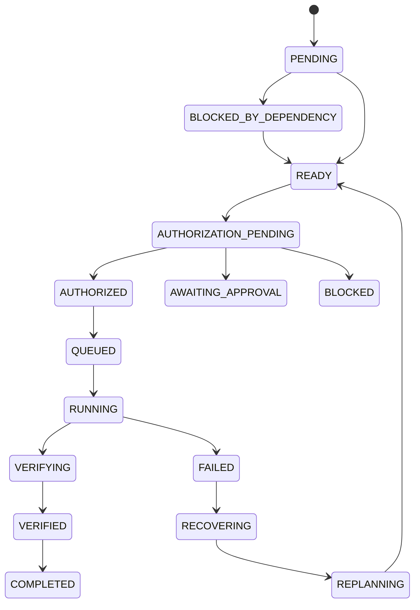

# Node state machine

## Invariants

- RUNNING requires job ref, persona, authorization decision
- AUTHORIZED requires decision = allow
- VERIFIED requires verification_evidence
- BLOCKED requires blocking_reason
