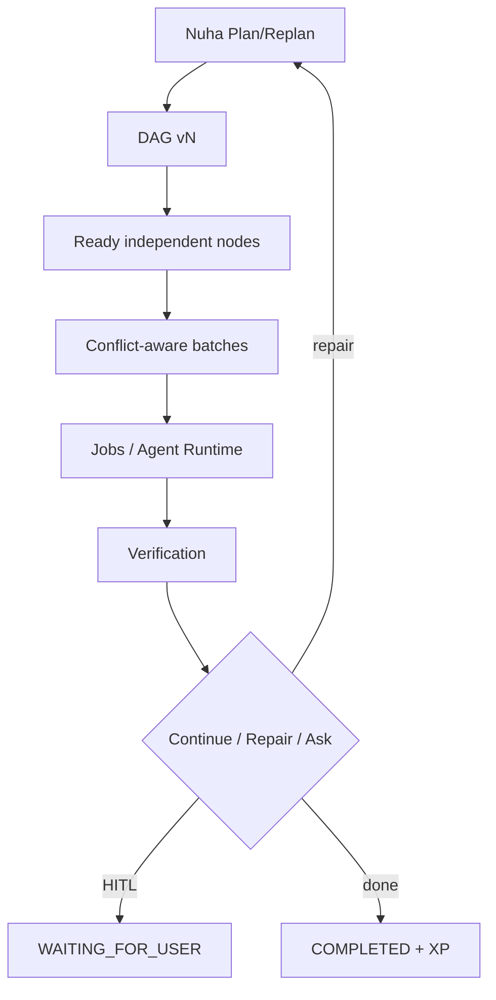

# Nuha Orchestration Architecture

## Responsibility boundaries

| Layer | Responsibility |
|-------|----------------|
| **Nuha** | Intelligence, planning, orchestration |
| **DAG** | What depends on what |
| **UCIP + specialty policy** | Whether it is permitted |
| **Jobs / Agent Runtime** | How/when work executes |
| **Verification** | Whether it actually worked |
| **XP** | Experience only — never authority |
| **Spatial UI** | Presentation |

## Flow

```text
User → Nuha → Chat | Plan | Action
                ↓
         OrchestrationPlan + DAG
                ↓
    Specialty policy ∩ UCIP constants
                ↓
      Existing Agent Runtime / Jobs
                ↓
           Verification → XP
```

Plan mode never writes. Action mode never skips UCIP.

## Durable execution (hardening)

Plans persist in `orchestration_plans` via `brain/orchestration_store.py`.

- `persist_plan` after PLAN_READY, auth outcomes, verify, complete/fail
- `get_plan_durable` reloads into memory after restart
- Job/task IDs referenced on nodes; no second job queue

## Verification contract

```
RUNNING → execution result → VERIFYING → evidence → VERIFIED → COMPLETED
```

Agent self-report alone is insufficient. `orchestration_verify` inspects workspace files.

## Capability normalization

`brain/capability_canon.py` maps `fs.read` / `ucip:filesystem.read` → `filesystem.read`.
Aliases never expand authority.

## Autonomous mission loop



- `get_ready_nodes` — all currently ready (not serialized by accident)
- `partition_ready_for_parallel` — write-path conflict batches
- `MAX_PARALLEL` env bound (default 3)
- Plan revisions preserve verified nodes; new nodes re-authorize
- Failure classification drives replan vs block
