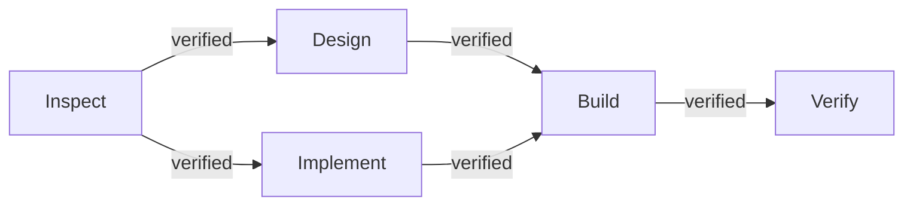

# Orchestration DAG

## Model

- **Nodes**: work units with persona, capabilities, verification criteria
- **Edges**: dependencies with condition (`verified` preferred, `completed` supported)

## Validation

Rejects: cycles, missing deps, self-deps, duplicate IDs, empty graph, missing persona/caps.

## Readiness

A node becomes READY only when all incoming edges satisfy their condition.
Failed nodes propagate `BLOCKED_BY_DEPENDENCY` to dependents.
