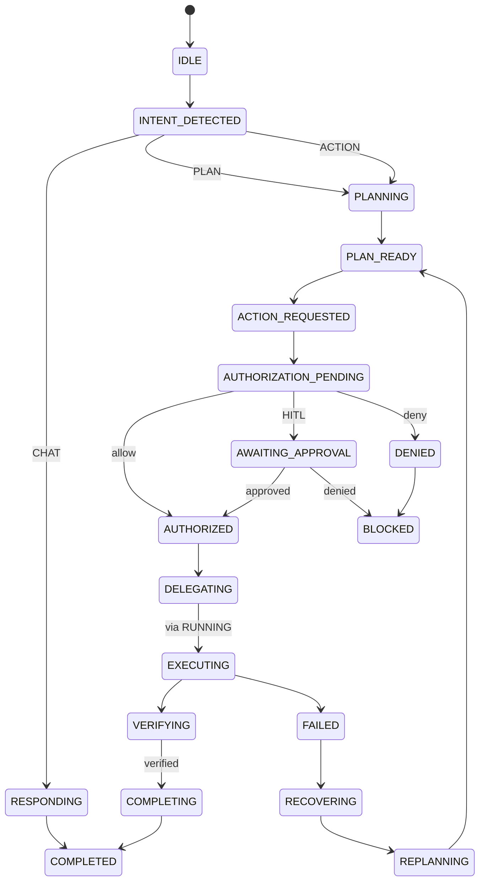

# Orchestration state machine

```mermaid
stateDiagram-v2
    [*] --> IDLE
    IDLE --> INTENT_DETECTED
    INTENT_DETECTED --> RESPONDING: CHAT
    INTENT_DETECTED --> PLANNING: PLAN
    INTENT_DETECTED --> PLANNING: ACTION
    RESPONDING --> COMPLETED
    PLANNING --> PLAN_READY
    PLAN_READY --> ACTION_REQUESTED
    ACTION_REQUESTED --> AUTHORIZATION_PENDING
    AUTHORIZATION_PENDING --> AUTHORIZED: allow
    AUTHORIZATION_PENDING --> AWAITING_APPROVAL: HITL
    AUTHORIZATION_PENDING --> DENIED: deny
    DENIED --> BLOCKED
    AWAITING_APPROVAL --> AUTHORIZED: approved
    AWAITING_APPROVAL --> BLOCKED: denied
    AUTHORIZED --> DELEGATING
    DELEGATING --> EXECUTING: via RUNNING
    EXECUTING --> VERIFYING
    VERIFYING --> COMPLETING: verified
    COMPLETING --> COMPLETED
    EXECUTING --> FAILED
    FAILED --> RECOVERING
    RECOVERING --> REPLANNING
    REPLANNING --> PLAN_READY
```

Invalid transitions raise `ValueError` (central transition table).
