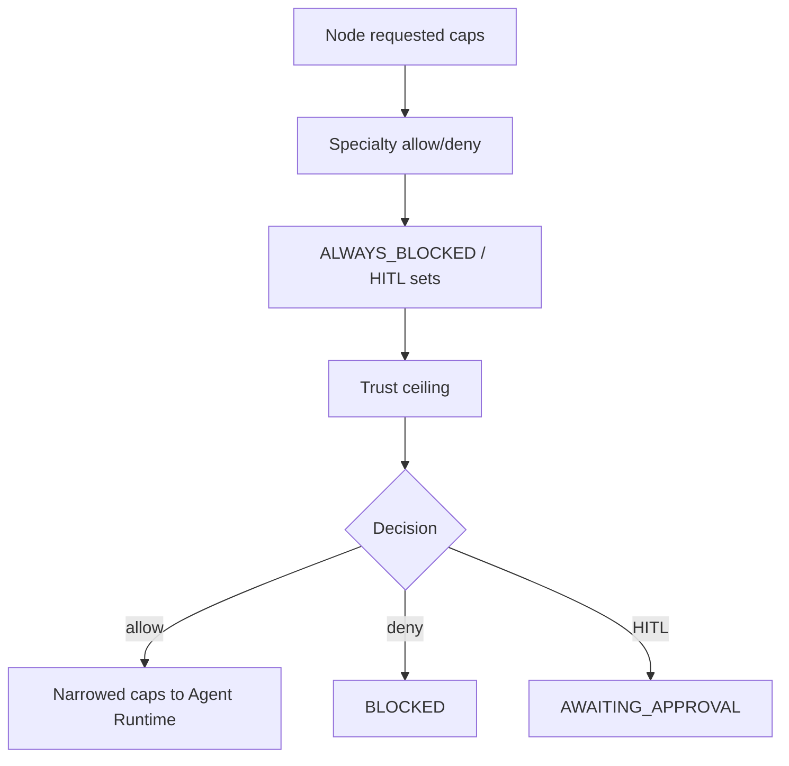

# Specialty UCIP policy

Declarative profiles per persona (web, code, design, research, …).

**Not** a second authorization engine. Tool execution still passes through UCIP / Agent Runtime.

Effective caps ≈ specialty allow ∩ ¬deny ∩ ¬ALWAYS_BLOCKED ∩ trust ceiling.

Lower layers never broaden higher-layer denies.
